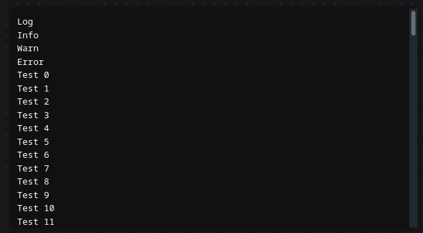

# Log JS

Simple script to display log in page.

## Usage

Add script in html file.

```html
  <script defer src="log.js"></script>
```
 
Execute function.
```js
// @param {string} msg - Message.
// @param {string} type - Type of message.

log('Log');
log('Info', 'info');
log('Warn', 'warn');
log('Error', 'error');

for (let i = 0; i <= 20; i++) {
  log('Test');
}
```

## Screenshots

